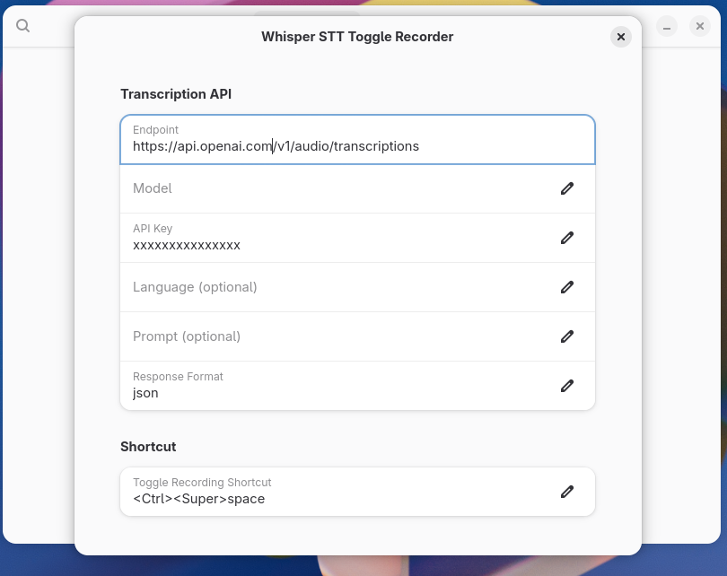

# whisper-client-gnome

A GNOME Shell extension that records microphone audio with a keyboard shortcut,
sends it to an OpenAI-compatible speech-to-text endpoint, then plays a tone and
copies the transcript to the clipboard.



## Installation

### Easy Install

Run the included install script in the terminal:

```bash
chmod +x install.sh
./install.sh
```

Then restart GNOME Shell (Log out/in on Wayland, or Alt+F2 typed 'r' on X11) and enable the extension.

### Manual Installation

1. Create the extension directory:
   ```bash
   mkdir -p ~/.local/share/gnome-shell/extensions/whisper-stt@fariszr.com
   ```
2. Copy the extension files:
   ```bash
   cp -r ./* ~/.local/share/gnome-shell/extensions/whisper-stt@fariszr.com/
   ```
3. Compile the schemas:
   ```bash
   glib-compile-schemas ~/.local/share/gnome-shell/extensions/whisper-stt@fariszr.com/schemas/
   ```

After installing, restart GNOME Shell and enable the extension:

```bash
gnome-extensions enable whisper-stt@fariszr.com
```

## Features

- Toggle recording with one shortcut press (start/stop)
- Live voice graph overlay while recording
- OpenAI-style `/v1/audio/transcriptions` request flow
- Works with empty API key (no Authorization header sent)
- Copies transcript to the GNOME clipboard

## Settings

Open extension preferences and configure:

- `Endpoint` (default: `https://api.openai.com/v1/audio/transcriptions`)
- `Model` (default: `whisper-1`)
- `API Key` (optional)
- `Language` and `Prompt` (optional)
- `Response Format` (`json` or `text`)
- Toggle shortcut accelerator string

## Development

Run tests:

```bash
./scripts/test.sh
```

Run tests with coverage output:

```bash
./scripts/coverage.sh
```

Compile extension schemas after editing `schemas/*.xml`:

```bash
glib-compile-schemas schemas
```
