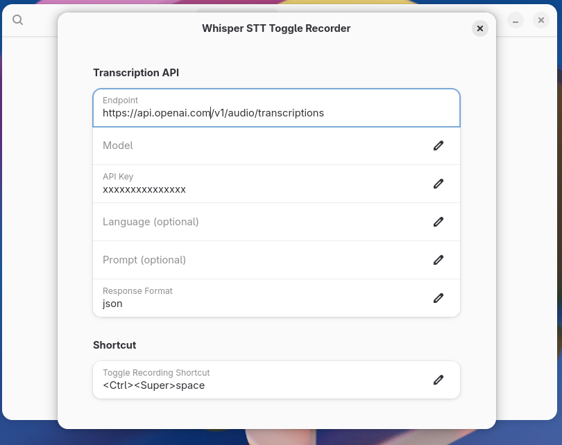

# whisper-client-gnome

A GNOME Shell extension that records microphone audio with a keyboard shortcut,
sends it to an OpenAI-compatible speech-to-text endpoint, then plays a tone and
copies the transcript to the clipboard.

Supported GNOME Shell versions: 49 and 50.



## Installation

### Homebrew (Linux)

Requires Homebrew 6 or newer and GNOME Shell 49 or 50:

```bash
brew tap fariszr/tap
brew trust fariszr/tap
brew install --cask whisper-stt-gnome-extension
```

The cask installs into `~/.local/share/gnome-shell/extensions/whisper-stt@fariszr.com`
for the user running Homebrew. Move an existing manual installation out of the
way first. Install your distribution's GStreamer tools/plugins (including
PulseAudio), curl, and `canberra-gtk-play` for notification sounds.
Log out and back in, then enable and configure the extension:

```bash
gnome-extensions enable whisper-stt@fariszr.com
gnome-extensions prefs whisper-stt@fariszr.com
```

Update with `brew update && brew upgrade --cask whisper-stt-gnome-extension`,
then log out and back in. Uninstall with
`brew uninstall --cask whisper-stt-gnome-extension`.

### Easy Install

Run the included install script in the terminal:

```bash
chmod +x install.sh
./install.sh
```

Then restart GNOME Shell (Log out/in on Wayland, or Alt+F2 typed 'r' on X11) and enable the extension.

### Manual Installation

1. Create the extension directory:
   ```bash
   mkdir -p ~/.local/share/gnome-shell/extensions/whisper-stt@fariszr.com
   ```
2. Copy the extension files:
   ```bash
   cp -r ./* ~/.local/share/gnome-shell/extensions/whisper-stt@fariszr.com/
   ```
3. Compile the schemas:
   ```bash
   glib-compile-schemas ~/.local/share/gnome-shell/extensions/whisper-stt@fariszr.com/schemas/
   ```

After installing, restart GNOME Shell and enable the extension:

```bash
gnome-extensions enable whisper-stt@fariszr.com
```

## Features

- Toggle recording with one shortcut press (start/stop)
- Live voice graph overlay while recording
- OpenAI-style `/v1/audio/transcriptions` request flow
- Works with empty API key (no Authorization header sent)
- Copies transcript to the GNOME clipboard

## Settings

Open extension preferences and configure:

- `Endpoint` (default: `https://api.openai.com/v1/audio/transcriptions`)
- `Model` (default: `whisper-1`)
- `API Key` (optional)
- `Language` and `Prompt` (optional)
- `Response Format` (`json` or `text`)
- `Bypass VPN connections` (optional, binds requests to a local interface like `enp6s0`)
- Toggle shortcut accelerator string

### Bypass VPN for this extension

If your transcription host blocks VPN egress, enable `Bypass VPN connections` in preferences and set your local interface name (for example `enp6s0` or `wlan0`).

This only affects this extension's transcription request and keeps your system VPN active for other traffic.

How it works:

1. The extension sends transcription requests with `curl`.
2. When bypass is enabled, it adds `--interface <name>` so the request uses the selected NIC.
3. Recording, UI, clipboard, and other system traffic are unchanged.

If requests time out, your VPN kill switch may be blocking non-tunnel traffic.

## Development

Run tests:

```bash
./scripts/test.sh
```

Build an installable GNOME Shell extension bundle:

```bash
./scripts/package.sh
python3 tests/check_package.py dist "$(git rev-parse HEAD)"
```

The package helper includes the `src/` module tree required by `extension.js`.
It compiles schemas and produces both an installable
`whisper-stt@fariszr.com.shell-extension.zip` and a Homebrew directory archive,
`whisper-stt-gnome-extension.tar.gz`. Both contain the same runtime files.
Build dependencies: GJS, `gnome-extensions` (provided by `gnome-shell` on Ubuntu),
`glib-compile-schemas`, Python 3, and Git.

### Rolling builds and tap publication

`Build extension` runs tests and builds bundles on pull requests and each push to
`main`. Successful `main` builds publish a GitHub release tagged `build-<full commit
hash>`, using the commit hash as the package version. GNOME's numeric metadata
version uses the commit count; `version-name` contains the full hash.
Published bundles remain unchanged when a build is rerun. Only builds of the
current `main` commit are marked latest, so delayed builds cannot select an old
commit. The workflow can also be run manually on `main`.

After publication, the workflow dispatches the Homebrew tap's `sync.yml`, which
checks the release asset and checksum and commits the updated cask. The tap also
checks for updates every six hours.

Add an Actions secret named `TAP_GITHUB_TOKEN` in this repository. Use a
fine-grained GitHub PAT scoped only to `FarisZR/homebrew-tap`, with **Actions:
read and write** (and the automatic Metadata read permission). No Contents write
permission is needed on that PAT. Release publication uses the built-in
`GITHUB_TOKEN` with Contents write; no extra release secret is needed.
See the tap's [token setup](https://github.com/FarisZR/homebrew-tap/blob/main/docs/tokens.md).
Without the dispatch secret, builds still publish and scheduled tap sync still works.

If publication fails after creating a draft release, delete that incomplete draft
and rerun the workflow on `main`. Never replace assets on a published commit release.

Run tests with coverage output:

```bash
./scripts/coverage.sh
```

Compile extension schemas after editing `schemas/*.xml`:

```bash
glib-compile-schemas schemas
```
